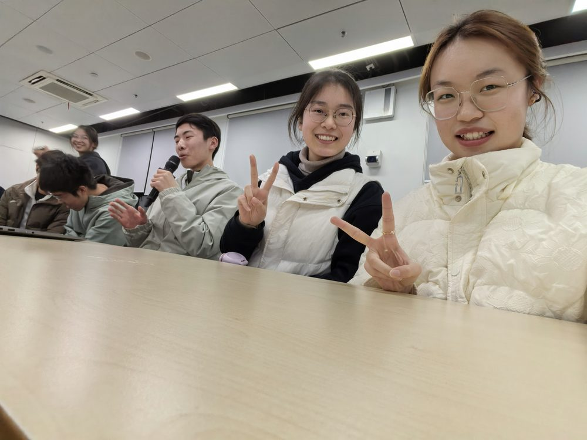
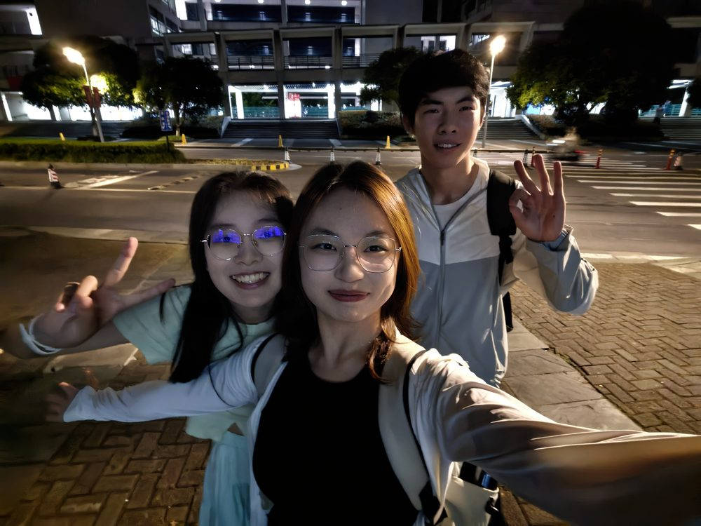
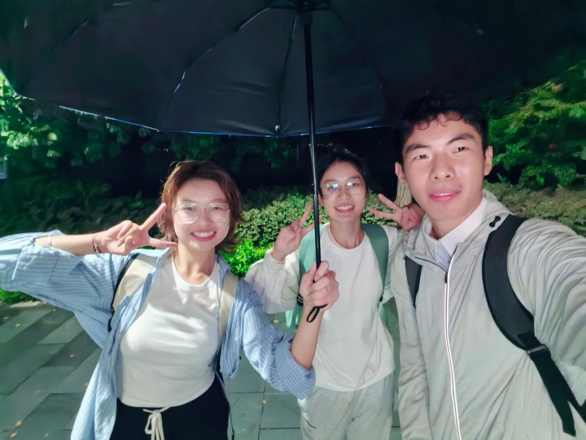

&#x20; <!-- 星光层（两幕通用） -->

    

    

    

  

<!-- 金色魔法光点（JS 生成） -->

<!-- 流星 -->

  
  
  

<!-- 魔法薄雾 -->

<!-- 守护神（银色发光小鹿） -->

🦌

<!-- 咒语文字（JS 生成） -->

<!-- 漂浮羽毛笔 -->

🪶

&#x20; <!-- 物理烟花画布 + 脚本（脚本只在本页加载） -->

<canvas id="fwSky"></canvas>

&#x20; 

<!-- 第三、四幕：点继续后出现（默认隐藏，点“点击继续”后 :target 显示） -->

<section id="photos">

    <figure>
      
    </figure>
    <figure>
      
    </figure>
    <figure>
      
    </figure>
  

    
🎂 大狗，生日快乐！⚡

    
—— 来自 小兔 &amp; 小猫 的魔法惊喜 ——

    

      欢迎来到 <strong>20 岁</strong>！霍格沃茨特快已驶入第 20 站台，奔三的魔法旅程正式开启（）嘻嘻
      再认认真真地对你说一句：<strong>生日快乐</strong> 🎉  
      蚊子咬永远是可以让我们放心依靠的存在（人形AI）嘻嘻。
      新的一岁，
      快乐会像有求必应屋里的烟花一样灿烂，烦恼会像被「消失咒」清空一样悄悄不见
       💙

永远的好朋友 ❤️　小兔 🐰 ｜ 小猫 🐱

<a href="#">↺ 想再看一遍魔法烟花？点这里重播</a>

<a class="next-btn" href="#wall">🪄 进入魔法相册 🪄</a>

</section>

<!-- 第三幕：霍格沃茨魔法相册照片墙 -->

<section id="wall">

    
相（偷）识（拍）的这一年里

    
Memories

  

    <svg viewBox="0 0 100 250">
      <defs>
        <linearGradient id="broomWood" x1="0" y1="0" x2="1" y2="0">
          <stop offset="0" stop-color="#6b3f18"/>
          <stop offset="0.5" stop-color="#b3763a"/>
          <stop offset="1" stop-color="#5e3512"/>
        </linearGradient>
        <linearGradient id="broomStraw" x1="0" y1="0" x2="0" y2="1">
          <stop offset="0" stop-color="#f0daa0"/>
          <stop offset="1" stop-color="#9c7a34"/>
        </linearGradient>
        <linearGradient id="broomBand" x1="0" y1="0" x2="0" y2="1">
          <stop offset="0" stop-color="#fff2c0"/>
          <stop offset="0.5" stop-color="#d4af37"/>
          <stop offset="1" stop-color="#8a6d1a"/>
        </linearGradient>
      </defs>
      <rect x="45" y="6" width="11" height="150" rx="5.5" fill="url(#broomWood)"/>
      <rect x="41" y="146" width="19" height="16" rx="4" fill="url(#broomBand)"/>
      <path d="M41 160 L60 160 L76 232 Q50 246 24 232 Z" fill="url(#broomStraw)"/>
      <g stroke="#8a6a2e" stroke-width="1.6" opacity="0.55" stroke-linecap="round">
        <line x1="45" y1="164" x2="34" y2="230"/>
        <line x1="50" y1="164" x2="44" y2="238"/>
        <line x1="55" y1="164" x2="56" y2="238"/>
        <line x1="58" y1="164" x2="66" y2="230"/>
      </g>
    </svg>
  

<a href="#photos">↺ 回到生日祝福</a>

</section>

<!-- 第一、二幕：默认开场画面（夜空烟花 + 中央卡通舞台） -->

<section id="s0">

&#x20; <!-- 闪电符号 -->

    <svg viewBox="0 0 24 24"><path d="M13 2 L3 14 H10 L9 22 L21 10 H14 Z"/></svg>
  

&#x20; <!-- 中央舞台：蛋糕 → 小狗(顶部) → 小猫(左) → 小兔(右) 依次浮现 -->

&#x20; <!-- 各角色会自动从 /assets/stickers/ 加载表情包；未放图时显示 emoji 兜底 -->

    
🎂

    
🐶

    
🐱

    
🐰

  

&#x20; <!-- 全部浮现后出现的提示：点击继续 -->

<a class="cont-btn" href="#photos">✨点击继续✨</a>

</section>

